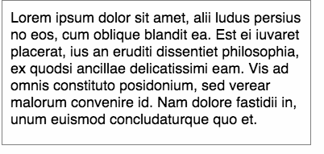

famous-autofontsizesurface
==========

Surface that automatically scales the font-size based on the content.




## Demo

[View the demo here](https://rawgit.com/IjzerenHein/famous-autofontsizesurface/master/demo/index.html)

    
## Getting started

Install using bower or npm:

    bower install famous-autofontsizesurface

    npm install famous-autofontsizesurface

Example of how to create a AutoFontSizeSurface:

```javascript
var AutoFontSizeSurface = require('famous-autofontsizesurface/AutoFontSizeSurface');

var autoFontSizeSurface = new AutoFontSizeSurface({
    fontSizeRange: [10, 18], // allow the font to scale between 10pt and 18pt.
    content: 'Lorem ipsum dolor sit amet, alii ludus persius no eos, cum oblique blandit ea. Est ei iuvaret placerat, ius an eruditi dissentiet philosophia, ex quodsi ancillae delicatissimi eam. Vis ad omnis constituto posidonium, sed verear malorum convenire id. Nam dolore fastidii in, unum euismod concludaturque quo et.',
});
this.add(autoFontSizeSurface);
```

To change the fontSizeRange afterwards, use:

```javascript
autoFontSizeSurface.setOptions({
    fontSizeRange: [8, 16]
});
```

To get the in-use fontSizeRange, use:

```javascript
var fontSizeRange = autoFontSizeSurface.getFontSizeRange();
```

To get the calculated font-size:

```javascript
var fontSize = autoFontSizeSurface.getFontSize();
```

When the calculated font-size changed, the `fontSizeChanged` event is emitted:

```javascript
autoFontSizeSurface.on('fontSizeChanged', function (fontSize) {
    console.log('fontsize is now: ' + fontSize);
});
```


## How it works

AutoFontSizeSurface creates a second hidden Surface in the DOM with a true-size height. This hidden surface is used to
calculate the best fitting font-size without affecting the original surface. This calculation is only performed when one
of these conditions is met:
- the `size` of the surface is changed
- the `content` is changed (setContent)
- the `options` are changed (setOptions)
- the surface `classes` are changed (addClass, removeClass, toggleClass, setClasses)
- a surface `property` is changed (setProperties)
- a surface `attribute` is changed (setAttributes)
- when `AutoFontSizeSurface.refreshAll()` is called


## Contribute

If you like this project and want to support it, show some love
and give it a star.

Special thanks to [flawk.to](http://www.flawk.to) for allowing me to share this code with the public.

© 2015 - Hein Rutjes
